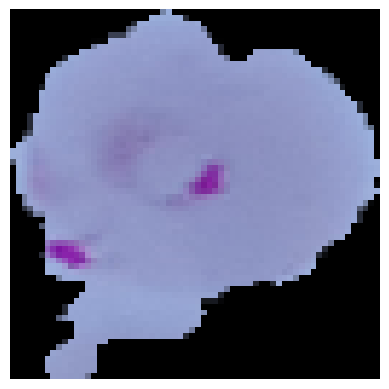
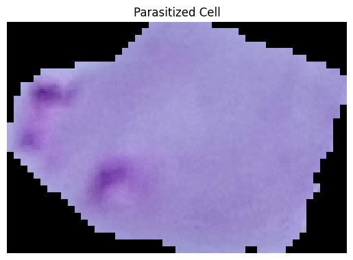
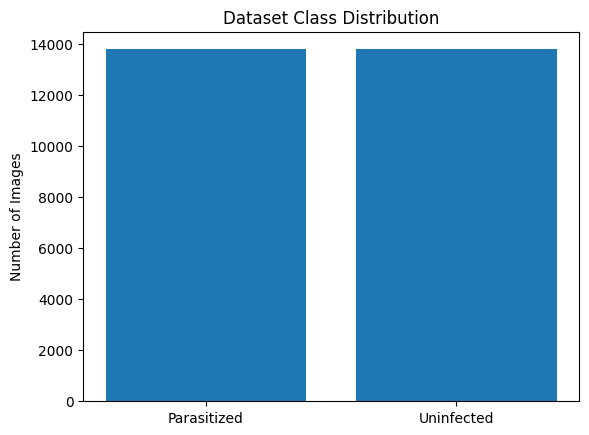
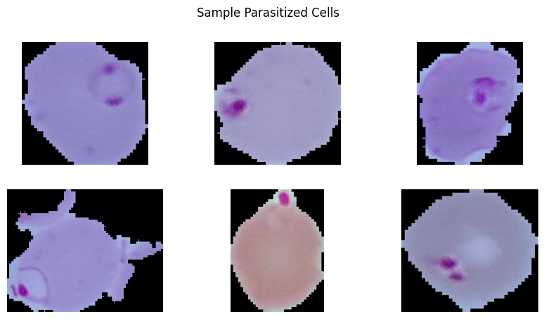
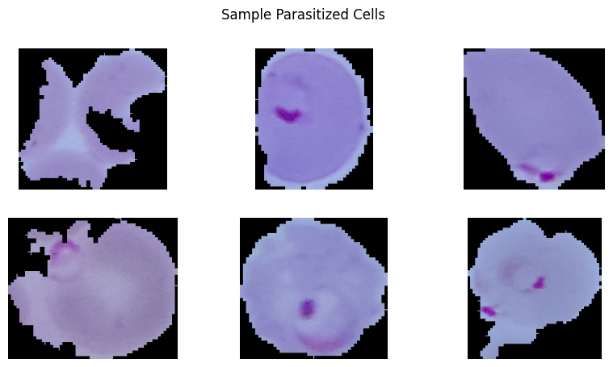

## Parasitized Cells

## Example Parasitized Cell

## Dataset Class Distribution

## Sample Parasitized Cells

## Sample Parasitized Cells

Project Structure
The project structure was designed to maintain a clear separation between the deep learning model, dataset resources, training environment, web application backend, and user interface components. This modular architecture improves readability, maintainability, and scalability of the system.
The system follows a client–server architecture, where the frontend interface communicates with a Flask backend that loads the trained CNN model and performs malaria detection on uploaded microscopic blood cell images.
malaria_detection/
│
├── app/
│   ├── app.py
│   └── templates/
│       └── index.html
│
├── dataset/
│   └── README.md
│
├── model/
│   ├── malaria_model.h5
│   ├── labels.txt
│   └── README.md
│
├── notebooks/
│   ├── malaria_training.ipynb
│   └── README.md
│
├── visuals/
│   ├── Data_class_Distribution.png
│   ├── Parasitized.png
│   ├── Parasitized_cell.png
│   └── README.md
│
└── README.md
app
The app folder contains the main web application responsible for interacting with the user and performing malaria detection using the trained deep learning model.
This module implements the backend logic using Python and Flask and connects the trained CNN model with the frontend interface.
app.py
•	This file is the core backend script of the system.
•	It performs several important functions:
•	Model Initialization
•	Imports required libraries such as TensorFlow, NumPy, Flask, and PIL.
•	Automatically searches for a .h5 file containing the trained CNN model.
•	Loads and compiles the model using:
•	Optimizer: Adam
•	Loss Function: Binary Crossentropy
•	Metric: Accuracy
Image Preprocessing
•	The prepare_image() function prepares uploaded images before sending them to the model.
•	Processing steps include:
•	Opening the uploaded image
•	Converting images to RGB format
•	Resizing images to match the model input dimensions
•	Normalizing pixel values between 0 and 1
•	Formatting the image array to match CNN input requirements
Prediction API
•	The /predict endpoint receives uploaded images and performs malaria classification.
•	The workflow includes:
•	Accepting an uploaded blood cell image
•	Preprocessing the image
•	Running the CNN model prediction
•	Calculating confidence scores
•	Returning prediction results as a JSON response
The response includes:
•	Prediction label (Parasitized or Uninfected)
•	Confidence score
•	Class probabilities
•	Timestamp of the prediction
Health Monitoring
•	The /health route provides a simple API endpoint to verify whether:
•	The Flask server is running
•	The deep learning model is successfully loaded
Server Execution
The application starts a local server when executed and runs at:
http://127.0.0.1:5000
templates
•	The templates folder contains the frontend user interface used by the system.
•	Flask uses HTML templates to render web pages dynamically.
index.html
•	This file implements the main user interface for the Malaria Detection System.
•	It is developed using HTML, CSS, and JavaScript and communicates with the Flask backend.
•	Features of the Interface
Navigation Section
Displays system branding MalariaScope – Neural Diagnostic Platform and indicates the operational status of the system.
Hero Section
•	Introduces the AI-powered diagnostic platform and provides key information such as:
•	Model accuracy
•	Average analysis time
•	Daily scan statistics
•	Image Upload System
•	Users can upload microscopic blood cell images through:
•	Drag-and-drop upload
•	File browser selection
•	Supported formats include:
•	PNG
•	JPG
•	JPEG
Image Preview
•	Before analysis, the interface shows:
•	Uploaded image preview
•	File name
•	File size
Image Analysis
When the user clicks Analyze Sample, the image is sent to the Flask backend via a POST request to the /predict API endpoint.
Diagnostic Result Display
•	After processing, the system generates a diagnostic report that includes:
•	Detection result (Parasitized or Uninfected)
•	Confidence percentage
•	Probability distribution for each class
•	Processing time
•	Timestamp of analysis
•	Visual indicators are used:
•	Green for Uninfected cells
•	Red for Parasitized cells
Medical Disclaimer
The interface includes a disclaimer stating that the system is intended as a screening tool for healthcare professionals and should not replace clinical diagnosis.
dataset
This folder contains documentation and instructions related to the dataset used for training the CNN model.
The dataset used in this project is the Malaria Cell Images Dataset from Kaggle.
Dataset Details
Total Images (Full Dataset): 27,558
Images Used in Project: 998
Parasitized Images: 499
Uninfected Images: 499
Image Format: PNG
Color Space: RGB
The dataset contains microscopic blood smear images used to train the CNN model for malaria parasite detection.
model
This folder stores the trained deep learning model and associated label information used for prediction.
malaria_model.h5
This file contains the trained Convolutional Neural Network (CNN) model used for malaria detection.
The model was trained using blood smear images and saved in HDF5 format, allowing it to be easily loaded by the Flask application for inference.
labels.txt
This file defines the classification labels used by the model:
0 – Parasitized
1 – Uninfected
notebooks
•	This folder contains the Jupyter Notebook used for model development, training, and evaluation.
•	malaria_training.ipynb
•	This notebook includes the full machine learning workflow:
•	Importing libraries
•	Loading the dataset
•	Data preprocessing
•	Data visualization
•	CNN model design
•	Model training
•	Performance evaluation
Saving the trained model
•	Libraries used include:
•	Pandas
•	NumPy
•	Matplotlib
•	Seaborn
•	TensorFlow / Keras
•	Scikit-learn
visuals
•	This folder contains visual resources and dataset illustrations used during analysis and documentation.
•	Examples include:
•	Data_class_Distribution.png
•	Shows the number of images in each dataset class.
•	Parasitized.png
•	Example image of a blood cell infected with malaria parasites.
•	Parasitized_cell.png
•	Microscopic visualization of malaria parasite presence inside red blood cells.
•	These visualizations help understand the dataset and demonstrate examples used for training the CNN model.
README.md
The root README file provides documentation for the entire project.
It typically includes:
Project overview
Objective of malaria detection using deep learning
Dataset information
System architecture
Instructions to run the application
Model description and results
This documentation helps developers and researchers understand how the system works and how to reproduce the results.
